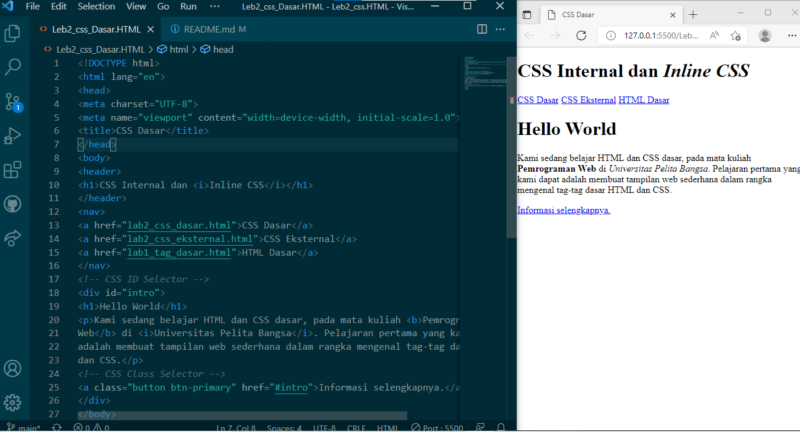
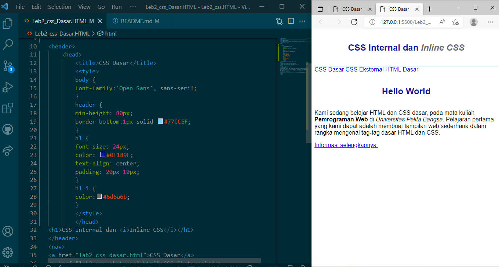

# Leb2_css.HTML

| Nama : | Fikri abei |
|------| ------------|
| Nim :| 312010417 |
|------| -----------|
| Kelas| : TI.20.A.1 |
|------|------------|
| Matkul |: Program Web |
|-------|--------------|
Langkah langkah peraktikum
1. Membuat Dokumen HTML

Selanjutnya buka pada brwoser untuk melihat hasilnya.
