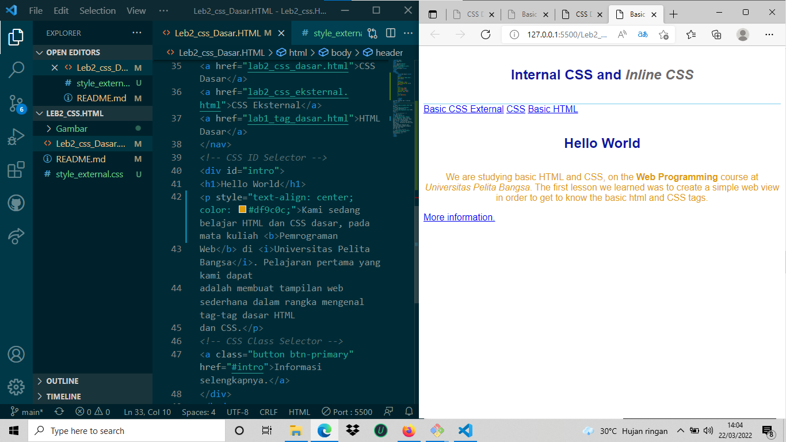
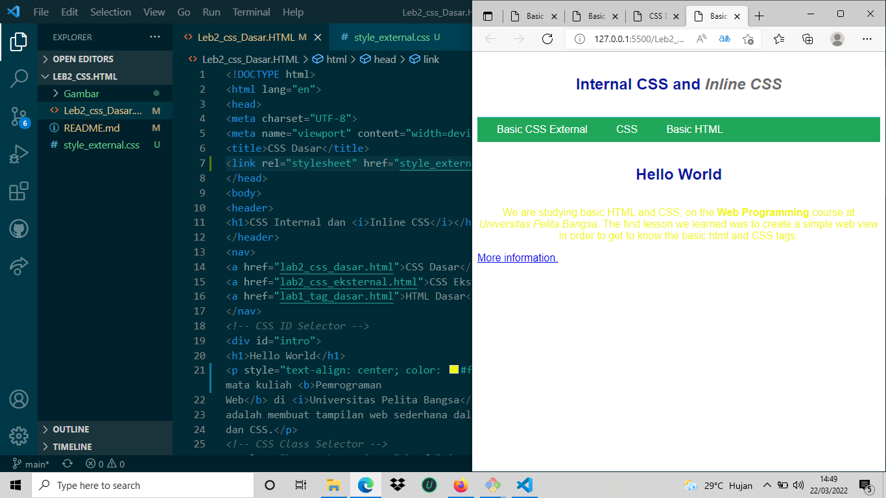

# Leb2_css.HTML

| Nama : | Fikri abei |
|------| ------------|
| Nim :| 312010417 |
|------| -----------|
| Kelas| : TI.20.A.1 |
|------|------------|
| Matkul |: Program Web |
|-------|--------------|
Langkah langkah peraktikum
1. Membuat Dokumen HTML

Selanjutnya buka pada brwoser untuk melihat hasilnya.

2. Mendeklarasikan CSS Internal
Selanjutnya simpan perubahan yang ada, dan lakukan refresh pada browser untuk melihat
hasilnya.

3. Menambahkan Inline CSS
