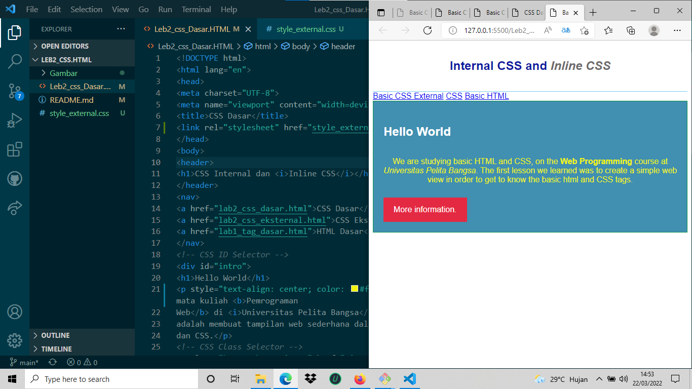

# Leb2_css.HTML

| Nama : | Fikri abei |
|------|------|
| Nim :| 312010417|
| Kelas| : TI.20.A.1 |
| Matkul |: Program Web |
 

Langkah langkah peraktikum
### 1. Membuat Dokumen HTML

Selanjutnya buka pada brwoser untuk melihat hasilnya.

### 2. Mendeklarasikan CSS Internal
Selanjutnya simpan perubahan yang ada, dan lakukan refresh pada browser untuk melihat
hasilnya.

### 3. Menambahkan Inline CSS

### 4. Membuat CSS Eksternal
Selanjutnya refresh kembali browser untuk melihat perubahannya.

### 5. Menambahkan CSS Selector
Kemudian simpan kembali dan refresh browser untuk melihat perubahannya.

Pertanyaan dan Tugas 

1. Lakukan eksperimen dengan mengubah dan menambah properti dan nilai pada kode CSS
dengan mengacu pada CSS Cheat Sheet yang diberikan pada file terpisah dari modul ini.
2. Apa perbedaan pendeklarasian CSS elemen h1 {...} dengan #intro h1 {...}? berikan
penjelasannya!
3. Apabila ada deklarasi CSS secara internal, lalu ditambahkan CSS eksternal dan inline CSS pada
elemen yang sama. Deklarasi manakah yang akan ditampilkan pada browser? Berikan
penjelasan dan contohnya!
4. Pada sebuah elemen HTML terdapat ID dan Class, apabila masing-masing selector tersebut
terdapat deklarasi CSS, maka deklarasi manakah yang akan ditampilkan pada browser?
Berikan penjelasan dan contohnya! ( `
` )